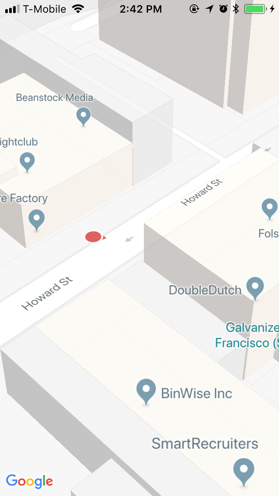

This is an example of Navisens' SDK integration with Google Maps' SDK.

First, retrieve a Google Maps access token [here](https://developers.google.com/maps/documentation/ios-sdk/get-api-key)<br/>and add the key to `GMSServices.provideAPIKey` in `AppDelegate.swift`.

Then retrieve a Navisens SDK key [here](https://navisens.com/#contact).
And add it to the `start(withDeveloperKey:)` method in the `ViewController.swift` file.

When you are done with all your key retrievals, run:
```bash
pod install // Will install MotionDna SDK and Google Maps SDK
open  ios-googlemaps-helloworld.xcworkspace // Will launch xcode
```

After completing these steps should be seeing the Navisens position on the Google Maps canvas.

Voila!



